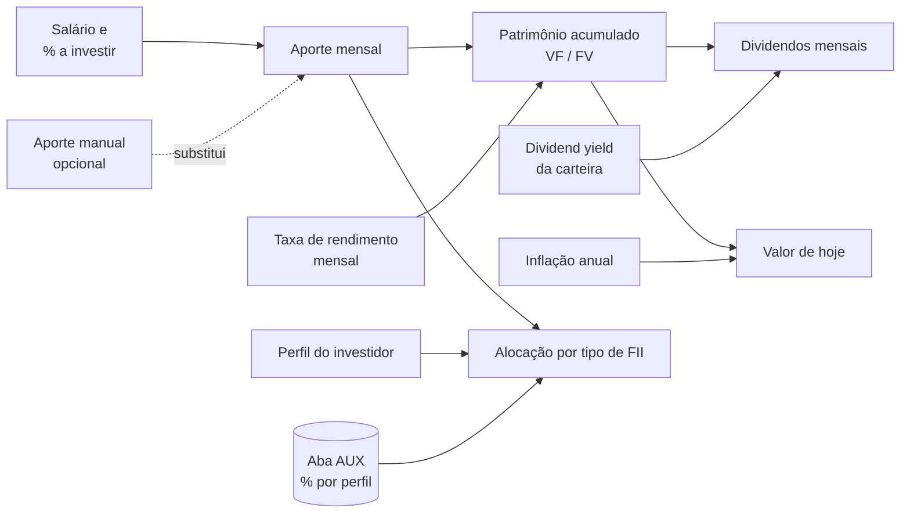

<div align="center">

# 🐷 DIO Invest

**Simulador de investimento mensal em Fundos Imobiliários (FIIs) em Excel**

Projete patrimônio, dividendos e alocação por perfil de investidor — sem macros, sem instalação, só fórmulas.

`Excel 2016+` · `LibreOffice Calc` · `Sem macros` · `v2.0.0` · `Licença MIT`

[Visão geral](#-visão-geral) •
[Como usar](#-como-usar) •
[Estrutura](#-estrutura-da-planilha) •
[Fórmulas](#-fórmulas-e-lógica-de-cálculo) •
[Premissas](#-premissas-e-limitações) •
[Contribuindo](#-como-contribuir)

</div>

---

> [!WARNING]
> **Aviso legal:** este projeto tem finalidade **exclusivamente educacional**. Os resultados são simulações baseadas em premissas editáveis e **não constituem recomendação de investimento**. Rentabilidade passada não garante rentabilidade futura. Antes de investir, consulte um profissional certificado.

## 📑 Sumário

- [Visão geral](#-visão-geral)
- [Funcionalidades](#-funcionalidades)
- [Requisitos e compatibilidade](#-requisitos-e-compatibilidade)
- [Como usar](#-como-usar)
- [Estrutura da planilha](#-estrutura-da-planilha)
- [Fórmulas e lógica de cálculo](#-fórmulas-e-lógica-de-cálculo)
- [Intervalos nomeados](#-intervalos-nomeados)
- [Validações e controles de qualidade](#-validações-e-controles-de-qualidade)
- [Premissas e limitações](#-premissas-e-limitações)
- [Estrutura do repositório](#-estrutura-do-repositório)
- [Roadmap](#-roadmap)
- [Como contribuir](#-como-contribuir)
- [Histórico de versões](#-histórico-de-versões)
- [Licença](#-licença)
- [Créditos](#-créditos)

## 🔎 Visão geral

O **DIO Invest** é uma planilha que responde a três perguntas de quem está começando a investir em FIIs:

1. **Quanto devo investir por mês?** Sugere um aporte com base em um percentual do salário, ou aceita um valor definido por você.
2. **Quanto vou acumular e quanto isso rende?** Projeta o patrimônio com juros compostos, estima os dividendos mensais e mostra o efeito da inflação.
3. **Como distribuir o aporte?** Divide o valor mensal entre seis tipos de FII conforme o perfil do investidor (Conservador, Moderado ou Agressivo).



## ✨ Funcionalidades

- **Aporte inteligente:** usa a sugestão (percentual do salário) ou um valor manual, que tem prioridade quando preenchido.
- **Projeção de patrimônio** com juros compostos para o prazo escolhido.
- **Estimativa de dividendos mensais** com base no dividend yield da carteira.
- **Cinco cenários de prazo editáveis** (2, 5, 10, 20 e 30 anos por padrão), com total aportado, juros, percentual de juros e valor de hoje. A linha correspondente ao prazo escolhido fica destacada.
- **Análise do período:** taxas equivalentes anuais, total aportado, juros acumulados e patrimônio descontado pela inflação.
- **Alocação por perfil de investidor** em seis tipos de FII (Papel, Tijolo, Híbridos, FOFs, Desenvolvimento e Hotelarias), com gráfico de pizza.
- **Controles de qualidade:** validação de dados nas entradas, tratamento de erros e verificação automática com alerta visual.
- **Premissas documentadas** em comentários de célula e em um bloco de notas na própria planilha.
- **Sem macros (VBA):** arquivo `.xlsx` puro, seguro para abrir e compartilhar.

## 💻 Requisitos e compatibilidade

| Software | Situação |
|---|---|
| Microsoft Excel 2016, 2019, 2021 e Microsoft 365 (Windows e macOS) | ✅ Suportado |
| Excel para a Web | ✅ Suportado |
| LibreOffice Calc 7+ | ✅ Verificado (fórmulas recalculam sem erros) |
| Google Planilhas | ⚠️ Não testado. As funções existem, mas comentários, validações e formatação condicional podem se comportar de forma diferente |

A planilha usa apenas funções clássicas, disponíveis desde o Excel 2007. Não depende de funções de matriz dinâmica (como `PROCX` ou `FILTRO`), suplementos ou conexões externas.

## 🚀 Como usar

1. **Baixe** o arquivo `DIO_INVESTIMENTO.xlsx` deste repositório (botão **Code → Download ZIP** ou diretamente pelo arquivo).
2. **Abra** no Excel ou no LibreOffice Calc. O recálculo acontece automaticamente ao abrir.
3. **Preencha as entradas** na aba `APP`. As células editáveis estão listadas na tabela abaixo.
4. **Escolha o perfil** na lista suspensa da célula `C30`.
5. **Confira o bloco Verificação.** Verde significa que está tudo consistente; vermelho indica que alguma entrada precisa de ajuste.

### Células editáveis

| Célula | Campo | Padrão | Observação |
|---|---|---|---|
| `D12` | Salário mensal | R$ 8.000,00 | Base para a sugestão de aporte |
| `D13` | Rendimento da carteira (dividend yield mensal) | 0,60% | ≈ 7,44% a.a. |
| `I12` | Percentual do salário a investir | 30% | Define a sugestão de aporte |
| `I13` | Aporte manual | *(vazio)* | Se preenchido, substitui a sugestão |
| `I14` | Inflação anual estimada | 4,50% | Usada no "valor de hoje" |
| `D18` | Prazo do investimento (anos) | 5 | Inteiro de 1 a 60 |
| `D19` | Taxa de rendimento mensal (retorno total) | 1,079% | ≈ 13,74% a.a. |
| `A24:A28` | Prazos dos cenários (anos) | 2, 5, 10, 20, 30 | Inteiros de 1 a 60 |
| `C30` | Perfil do investidor | Agressivo | Lista: Conservador, Moderado, Agressivo |
| `AUX!D3:D20` | Percentuais de alocação por perfil | ver abaixo | Cada perfil deve somar 100% |

> [!TIP]
> Quer simular um valor fixo, como R$ 200 por mês? Digite o valor em `I13`. Para voltar a usar a sugestão baseada no salário, basta apagar a célula.

## 🧱 Estrutura da planilha

### Aba `APP` (interface)

| Bloco | Intervalo | Conteúdo |
|---|---|---|
| Configurações | `B11:D14` | Salário, dividend yield e sugestão de investimento |
| Premissas | `F11:I14` | Percentual a investir, aporte manual e inflação |
| Investimento mensal | `B16:D21` | Aporte, prazo, taxa, patrimônio e dividendos |
| Análise do período | `F16:I21` | Taxas anuais, total aportado, juros e valor de hoje |
| Cenários | `A23:I28` | Projeções por prazo |
| Perfil e alocação | `B30:D40` | Perfil, aporte e distribuição por tipo de FII |
| Verificação | `F33:I34` | Status de consistência da alocação |
| Gráfico | abaixo da tabela | Pizza com a distribuição percentual |
| Notas | `B56:I60` | Explicação das premissas |

### Aba `AUX` (tabela de apoio)

A tabela de alocação usa uma **chave composta** (`Perfil-Tipo`), gerada pela fórmula `=B3&"-"&C3`. Isso permite buscar o percentual com dois critérios usando um único `PROCV`.

| Tipo de FII | Conservador | Moderado | Agressivo |
|---|---|---|---|
| Papel | 30% | 32% | 50% |
| Tijolo | 50% | 35% | 10% |
| Híbridos | 10% | 8% | 5% |
| FOFs | 10% | 5% | 5% |
| Desenvolvimento | 0% | 10% | 20% |
| Hotelarias | 0% | 10% | 10% |
| **Total** | **100%** | **100%** | **100%** |

A aba também contém:

- **Conferência** (`G7:I10`): soma dos percentuais de cada perfil, com status "OK" ou "Ajustar".
- **Teste de busca** (`G3:H4`): célula de apoio para testar chaves manualmente.

## 🧮 Fórmulas e lógica de cálculo

As fórmulas abaixo estão na sintaxe em inglês, como ficam gravadas no arquivo. No Excel em português, elas aparecem traduzidas automaticamente (por exemplo, `FV` → `VF`, `VLOOKUP` → `PROCV`, `IFERROR` → `SEERRO`, `TRIM` → `ARRUMAR`).

### Aporte e patrimônio

| Célula | Cálculo | Fórmula |
|---|---|---|
| `D14` | Sugestão de investimento | `=salario*perc_investimento` |
| `D17` | Aporte mensal efetivo | `=IF(ISBLANK(aporte_manual),sugestao_investimento,aporte_manual)` |
| `D20` | Patrimônio acumulado | `=IFERROR(FV(taxa_mensal,qtd_anos*12,-aporte),0)` |
| `D21` | Dividendos mensais | `=patrimonio*rendimento_carteira` |

O patrimônio é o **valor futuro de uma série uniforme de aportes**, com depósitos no fim de cada mês:

$$
VF = A \cdot \frac{(1+i)^{n} - 1}{i}
$$

em que $A$ é o aporte mensal, $i$ é a taxa mensal e $n$ é o número de meses (`qtd_anos * 12`). O aporte entra com sinal negativo (`-aporte`) porque a função `FV` segue a convenção de fluxo de caixa: dinheiro que sai é negativo, e assim o resultado sai positivo.

### Análise do período

| Célula | Cálculo | Fórmula |
|---|---|---|
| `I17` | Dividend yield anual equivalente | `=(1+rendimento_carteira)^12-1` |
| `I18` | Taxa de rendimento anual equivalente | `=(1+taxa_mensal)^12-1` |
| `I19` | Total aportado | `=aporte*qtd_anos*12` |
| `I20` | Juros acumulados | `=patrimonio-I19` |
| `I21` | Patrimônio em valor de hoje | `=patrimonio/(1+inflacao_anual)^qtd_anos` |

### Cenários (linhas 24 a 28)

| Coluna | Cálculo | Fórmula (linha 24) |
|---|---|---|
| `B` | Rótulo dinâmico | `="Quanto em "&A24&" Anos ?"` |
| `C` | Patrimônio | `=IFERROR(FV(taxa_mensal,$A24*12,-aporte),0)` |
| `D` | Dividendo mensal | `=C24*rendimento_carteira` |
| `F` | Total aportado | `=aporte*$A24*12` |
| `G` | Juros | `=C24-F24` |
| `H` | % do patrimônio que veio de juros | `=IF(C24=0,0,G24/C24)` |
| `I` | Valor de hoje | `=C24/(1+inflacao_anual)^$A24` |

A referência mista `$A24` fixa a coluna dos anos e deixa a linha livre, o que permite copiar a fórmula para as demais linhas.

### Alocação por perfil (linhas 34 a 40)

| Célula | Cálculo | Fórmula (linha 34) |
|---|---|---|
| `C34` | Percentual do tipo de FII | `=IFERROR(VLOOKUP(TRIM(perfil)&"-"&B34,AUX!$A:$D,4,FALSE),0)` |
| `D34` | Valor em reais | `=C34*$C$31` |
| `C40` | Soma dos percentuais | `=SUM(C34:C39)` |
| `D40` | Soma dos valores | `=SUM(D34:D39)` |

`TRIM` remove espaços acidentais do perfil antes de montar a chave. Com isso, "Moderado" e " Moderado" produzem o mesmo resultado.

## 🏷️ Intervalos nomeados

Todas as fórmulas usam nomes em vez de endereços de célula. Isso torna a leitura mais clara e a manutenção mais segura.

| Nome | Referência | Descrição |
|---|---|---|
| `salario` | `APP!$D$12` | Salário mensal |
| `rendimento_carteira` | `APP!$D$13` | Dividend yield mensal |
| `sugestao_investimento` | `APP!$D$14` | Sugestão de aporte |
| `aporte` | `APP!$D$17` | Aporte mensal efetivo |
| `qtd_anos` | `APP!$D$18` | Prazo em anos |
| `taxa_mensal` | `APP!$D$19` | Retorno total mensal |
| `patrimonio` | `APP!$D$20` | Patrimônio acumulado |
| `perc_investimento` | `APP!$I$12` | Percentual do salário a investir |
| `aporte_manual` | `APP!$I$13` | Aporte manual (opcional) |
| `inflacao_anual` | `APP!$I$14` | Inflação anual estimada |
| `perfil` | `APP!$C$30` | Perfil do investidor |

## 🛡️ Validações e controles de qualidade

| Controle | Onde | Regra |
|---|---|---|
| Lista suspensa | `C30` | Aceita apenas Conservador, Moderado ou Agressivo |
| Prazo | `D18`, `A24:A28` | Número inteiro de 1 a 60 |
| Taxas mensais | `D13`, `D19` | Decimal entre 0% e 10% |
| Percentuais | `I12`, `I14` | Decimal entre 0% e 100% |
| Valores monetários | `D12`, `I13` | Maior ou igual a zero |
| Tratamento de erros | Fórmulas `FV` e `VLOOKUP` | `IFERROR` retorna 0 em vez de `#N/D` |
| Verificação da alocação | `F34` | Sinaliza perfil inválido, soma diferente de 100% ou total diferente do aporte |
| Conferência dos perfis | `AUX!G7:I10` | Status "OK" quando a soma do perfil é 100% |
| Destaque de cenário | `B24:I28` | Formatação condicional na linha igual a `qtd_anos` |

## ⚖️ Premissas e limitações

- **Duas taxas com papéis diferentes.** A taxa de rendimento mensal (`D19`) representa o **retorno total**, ou seja, dividendos reinvestidos mais valorização, e é usada para projetar o patrimônio. O rendimento da carteira (`D13`) representa apenas o **dividend yield** e é usado para estimar a renda mensal.
- **Taxas constantes.** A simulação assume taxas fixas durante todo o período. Na prática, rentabilidade e dividendos variam.
- **Valores nominais.** Com exceção das colunas "Valor de hoje", os valores não descontam inflação.
- **Sem custos e tributos.** Não considera corretagem, taxas de administração, emolumentos ou Imposto de Renda sobre ganho de capital.
- **Aportes constantes no fim de cada mês.** Não há reajuste do aporte ao longo do tempo.
- **Alocação ilustrativa.** Os percentuais por perfil são exemplos didáticos e devem ser ajustados à sua estratégia.
- **Premissas editáveis.** Recomenda-se atualizar a inflação com a projeção vigente de IPCA (por exemplo, o Boletim Focus do Banco Central) e o dividend yield com a média de referência do mercado de FIIs.

## 📁 Estrutura do repositório

```text
.
├── DIO_INVESTIMENTO.xlsx   # Planilha do simulador
├── README.md               # Este arquivo
└── LICENSE                 # Termos da licença
```

## 🗺️ Roadmap

- [ ] Reajuste anual do aporte (por exemplo, pela inflação)
- [ ] Aporte inicial, além dos aportes mensais
- [ ] Simulação de Imposto de Renda e custos operacionais
- [ ] Gráfico de evolução do patrimônio ao longo do tempo
- [ ] Meta de renda passiva: prazo necessário para atingir um dividendo mensal desejado
- [ ] Versão validada para Google Planilhas

## 🤝 Como contribuir

Contribuições são bem-vindas. Para manter o histórico organizado:

1. Faça um **fork** do repositório.
2. Crie uma branch descritiva: `git checkout -b feat/reajuste-aporte`.
3. Faça suas alterações na planilha e **descreva no Pull Request** quais células e fórmulas mudaram. Arquivos `.xlsx` são binários, e o Git não mostra as diferenças linha a linha.
4. Use mensagens de commit no padrão [Conventional Commits](https://www.conventionalcommits.org/pt-br/): `feat:`, `fix:`, `docs:`, `refactor:`.
5. Antes de abrir o PR, confirme que:
   - não há erros de fórmula (`#N/D`, `#VALOR!`, `#NOME?`);
   - o bloco **Verificação** está verde nos três perfis;
   - cada perfil na aba `AUX` soma 100%;
   - novas premissas estão documentadas em comentário de célula e neste README.
6. Abra o **Pull Request** para a branch `main`.

Encontrou um problema ou tem uma sugestão? Abra uma **issue** descrevendo o comportamento esperado, o comportamento observado e os valores de entrada usados.

## 📝 Histórico de versões

Este projeto segue o [Versionamento Semântico](https://semver.org/lang/pt-BR/) e o formato [Keep a Changelog](https://keepachangelog.com/pt-BR/1.1.0/).

### [2.0.0]

**Adicionado**
- Painel **Premissas** com percentual a investir, aporte manual e inflação anual.
- Painel **Análise do Período** com taxas anuais equivalentes, total aportado, juros e valor de hoje.
- Colunas de total aportado, juros, percentual de juros e valor de hoje nos cenários.
- Bloco **Verificação** e conferência da soma dos perfis na aba `AUX`.
- Validação de dados em todas as entradas, comentários explicativos e bloco de notas.
- Destaque automático do cenário igual ao prazo escolhido.
- Novos nomes definidos: `perc_investimento`, `aporte_manual`, `inflacao_anual` e `perfil`.

**Alterado**
- O aporte mensal passa a usar a sugestão baseada no salário, com a opção de valor manual. **Mudança incompatível:** com as premissas padrão, o aporte passa de R$ 200 para R$ 2.400. Para reproduzir a versão anterior, informe 200 em `I13`.
- Fórmulas de cenário padronizadas com intervalos nomeados e rótulos dinâmicos.
- Taxa mensal exibida com três casas decimais (1,079%).

**Corrigido**
- Lista de perfis sem espaços extras e busca com `TRIM`, evitando `#N/D`.
- Tratamento de erros com `IFERROR` nas funções `FV` e `VLOOKUP`.

### [1.0.0]

- Versão inicial: projeção de patrimônio, dividendos, cenários de prazo e alocação por perfil.

## 📄 Licença

Distribuído sob a licença **MIT**. Consulte o arquivo [`LICENSE`](LICENSE) para mais detalhes.

## 🙌 Créditos

Projeto desenvolvido no contexto de um desafio da **[DIO](https://www.dio.me/)**.

<div align="center">

Feito com 🐷 e juros compostos.

</div>
